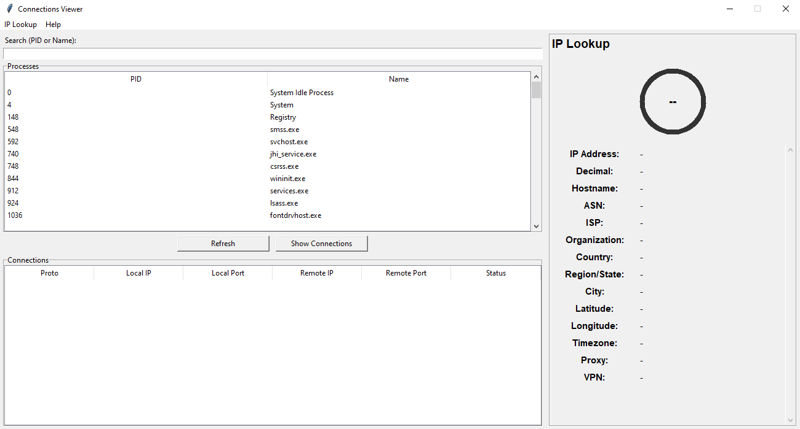

# Connections Viewer

## Overview
**Connections Viewer** is a Python GUI tool to monitor system processes and network connections, perform IP intelligence, and display geolocation on Google Maps. Ideal for system administrators, network analysts, and cybersecurity enthusiasts.

---

## Features

### Process & Connection Viewer
- Lists running processes (PID & Name & status)
- Right-click actions: Open file location for process, kill proess, Block or unblock for process
- Refresh process list

### Connection Viewer
- Shows active connections (Local/Remote IP & Port, Protocol, Status)
- show connection type (TCP & UDP)
- Right-click actions: copy values, perform IP lookup  

### IP Lookup
- Rate of IP security.
- Displays IP, Decimal, Hostname, ASN, ISP, Organization  
- Shows location: Country, Region, City, Latitude/Longitude (Google Maps link)  
- Timezone information  
- Right-click to copy any field  

### Search & Filtering
- Instant search by PID or process name  
- Real-time list updates

## IP loockup result

